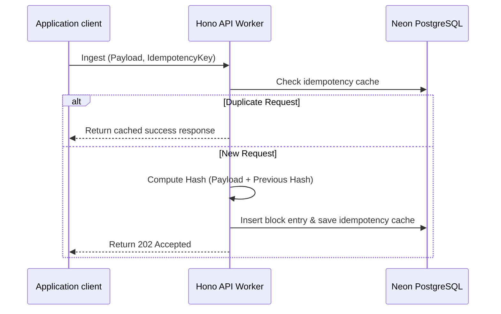

<div align="center">
  
  <h1 align="center">ProofLog</h1>
  <p align="center">
    <strong>Zero-trust cryptographic audit log ledger for typescript applications</strong>
  </p>
  <p align="center">
    <a href="https://github.com/RahulDew/prooflog/actions"></a>
    <a href="https://www.npmjs.com/package/@prooflog/node"></a>
    <a href="https://github.com/RahulDew/prooflog/blob/main/LICENSE"></a>
  </p>
</div>

---

**ProofLog** is an open-source audit logging system using cryptographic hash chaining to guarantee log integrity. Each log entry is linked to its preceding event payload. If any historical record is modified or deleted at the database layer, the validation chain breaks, exposing the tampering sequence.

## 📦 Monorepo Workspace Packages

Managed with `pnpm` workspaces:

| Package | Description | Version |
|---------|-------------|---------|
| [`@prooflog/node`](./packages/sdk) | Client SDK for log ingestion and cryptographic verification | `0.1.2` |
| [`@prooflog/react`](./packages/react) | Component library for secure audit timeline displays | `0.1.0` |
| [`@prooflog/crypto`](./packages/crypto) | SHA-256/384/512 cryptographic hashing operations | `0.0.1` |
| [`@prooflog/db`](./packages/db) | Drizzle ORM schema mappings for PostgreSQL | `0.0.1` |
| [`@prooflog/web`](./apps/web) | Documentation landing page and verification dashboard | `private` |

## ⚙️ Key Primitives

1. **Cryptographic Integrity**: Links event blocks sequentially using customizable hashing configurations (SHA-256, SHA-384, or SHA-512).
2. **Safe Retry Delivery**: Utilizes unique idempotency keys to recover from concurrent network retries without creating duplicate log writes.
3. **Serverless Infrastructure**: Built using Hono Workers on Cloudflare edge context and optimized Neon Serverless drivers over HTTP connections.

---

## 💻 Installation

```bash
pnpm add @prooflog/node @prooflog/react
```

## 🛠️ Implementation Example

### 1. Ingestion (Cloudflare Worker or Node.js server)

Initialize the SDK client and pass payload attributes along with idempotency and hardening parameters:

```typescript
import { ProofLog } from '@prooflog/node';

const client = new ProofLog({ apiKey: process.env.PROOFLOG_API_KEY });

// Ingest a tamper-proof block
await client.ingest('org_1234', {
  action: 'billing.invoice_paid',
  actor: { id: 'usr_99' },
  idempotencyKey: 'invoice_payment_req_xyz',
  chainVersion: 2, // binds ledger version metadata
  hashAlgorithm: 'sha512' // options: sha256 | sha384 | sha512
});
```

### 2. Cryptographic Chain Verification

Periodically execute verification routines to mathematically guarantee ledger integrity:

```typescript
const result = await client.verify('org_1234');

if (!result.valid) {
  console.error(`Tampering detected at sequence: ${result.tamperedAt}`);
  console.error(`Expected: ${result.expectedHash} | Stored: ${result.actualHash}`);
} else {
  console.log(`Success: All ${result.totalEntries} event blocks verified.`);
}
```

### 3. Frontend Timeline Interface

Import the styling sheet and embed the timeline widget:

```tsx
import { ProofLogTimeline } from '@prooflog/react';
import '@prooflog/react/dist/index.css';

function LogViewer({ logs }) {
  return (
    <div className="min-h-screen bg-zinc-950 p-8">
      <ProofLogTimeline 
        logs={logs} 
        title="Audit Trail" 
      />
    </div>
  );
}
```

---

## 🏗️ System Flow



---

## 🤝 Local Setup & Contribution

1. Clone the repository and install workspace dependencies:
   ```bash
   pnpm install
   ```
2. Configure environment credentials in `.env` inside target package paths.
3. Push database tables and run migration tasks:
   ```bash
   pnpm --filter @prooflog/db run push
   ```
4. Start local development watch loops:
   ```bash
   pnpm -r dev
   ```

## License

MIT
