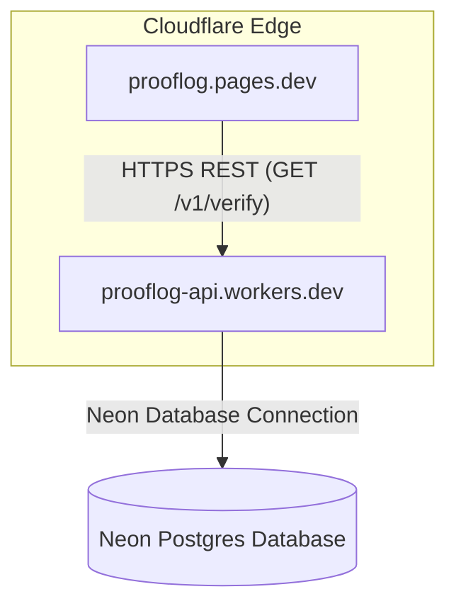

# ProofLog Cloudflare Deployment Guide

This guide documents the full-stack serverless deployment process for the **ProofLog** analytics ledger. The application is hosted entirely on Cloudflare using **Cloudflare Pages** (for the React frontend) and **Cloudflare Workers** (for the Hono API backend), backed by **Neon Serverless Postgres**.

---

## 🏗️ Architecture Design



---

## 📋 Step-by-Step Deployment Actions & Command Outputs

### Step 1: Authentication Check
First, verify that Wrangler is authorized with the correct Cloudflare account scope:

* **Command**:
  ```bash
  pnpm --filter @prooflog/api exec wrangler whoami
  ```
* **Response Output**:
  ```text
   ⛅️ wrangler 3.114.17 (update available 4.107.0)
  ------------------------------------------------
  Getting User settings...
  👋 You are logged in with an OAuth Token, associated with the email rahul@letscooee.com.
  ┌──────────────────┬──────────────────────────────────┐
  │ Account Name     │ Account ID                       │
  ├──────────────────┼──────────────────────────────────┤
  │ RahulDew Account │ 9c0f607969db8010f6379d28d8162fbd │
  └──────────────────┴──────────────────────────────────┘
  🔓 Token Permissions:
  Scope (Access)
  - account (read)
  - user (read)
  - workers (write)
  - workers_kv (write)
  - workers_routes (write)
  - workers_scripts (write)
  - workers_tail (read)
  - d1 (write)
  - pages (write)
  - zone (read)
  - ssl_certs (write)
  - ai (write)
  - queues (write)
  - pipelines (write)
  - offline_access 
  ```

---

### Step 2: Creating the Pages Project
Create the static hosting bucket on Cloudflare Pages targeting the primary branch:

* **Command**:
  ```bash
  pnpm --filter @prooflog/api exec wrangler pages project create prooflog --production-branch=main
  ```
* **Response Output**:
  ```text
  ✨ Successfully created the 'prooflog' project. It will be available at https://prooflog.pages.dev/ once you create your first deployment.
  To deploy a folder of assets, run 'wrangler pages deploy [directory]'.
  ```

---

### Step 3: Deploying the Backend API (Worker)
Deploy the Hono API backend route handling context. The compile configuration is bundled into a single file and uploaded:

* **Command**:
  ```bash
  pnpm --filter @prooflog/api run deploy
  ```
* **Response Output**:
  ```text
  > @prooflog/api@0.0.1 deploy /Users/Ramesh/projects/prooflog/apps/api
  > wrangler deploy

   ⛅️ wrangler 3.114.17 (update available 4.107.0)
  ------------------------------------------------
  Total Upload: 1093.64 KiB / gzip: 204.56 KiB
  Worker Startup Time: 19 ms
  No bindings found.
  Uploaded prooflog-api (11.65 sec)
  Deployed prooflog-api triggers (2.76 sec)
    https://prooflog-api.rahul-9c0.workers.dev
  Current Version ID: 57b805d8-e0e7-48ef-b285-ebddfb409a3e
  ```

---

### Step 4: Binding the Database Secrets
Securely upload the Neon connection string to the Worker environment variables KMS registry:

* **Command**:
  ```bash
  echo "postgresql://..." | pnpm --filter @prooflog/api exec wrangler secret put DATABASE_URL
  ```
* **Response Output**:
  ```text
   ⛅️ wrangler 3.114.17 (update available 4.107.0)
  ------------------------------------------------
  🌀 Creating the secret for the Worker "prooflog-api" 
  ✨ Success! Uploaded secret DATABASE_URL
  ```

---

### Step 5: Building and Deploying the Web Frontend
Configure the API address fallback under `config.constants.ts` to use `https://prooflog-api.rahul-9c0.workers.dev`, compile the production build bundle, and deploy:

* **Build Command**:
  ```bash
  pnpm --filter @prooflog/web build
  ```
* **Deploy Command**:
  ```bash
  pnpm --filter @prooflog/api exec wrangler pages deploy /Users/Ramesh/projects/prooflog/apps/web/dist --project-name=prooflog --commit-dirty=true
  ```
* **Response Output**:
  ```text
  Uploading... (12/12)
  ✨ Success! Uploaded 12 files (1.98 sec)

  🌎 Deploying...
  ✨ Deployment complete! Take a peek over at https://8824fbaf.prooflog.pages.dev
  ```

---

## 🛠️ Verification & CORS Details

1. **Production URL**: The client frontend connects to the API at the live production URL alias **[https://prooflog.pages.dev](https://prooflog.pages.dev)**.
2. **CORS Handling**: Hono's `cors()` middleware is configured to authorize cross-origin fetches from the frontend subdomain, preventing web browsers from blocking connection pipelines.
3. **Ledger Decoupling**: Frontend verification calls do not touch Neon directly; all queries execute verification logic within the serverless Hono Worker.
